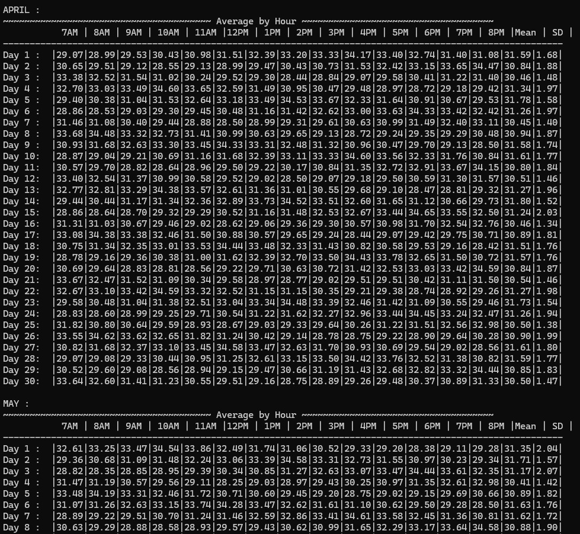
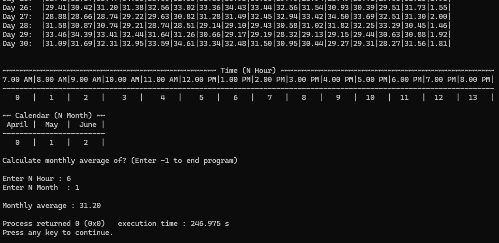

## Features

- Processes 5,040 temperature readings across April, May and June
- Groups four readings to calculate hourly averages
- Calculates daily mean and standard deviation
- Displays analysed data in formatted monthly tables
- Allows users to select a month and hour
- Calculates the monthly average for the selected time period
- Includes input validation for month and hour selections

## Sample Output

The program displays hourly averages, daily mean and standard deviation for each month.

Users can then select a specific month and hour to retrieve the corresponding monthly average.

